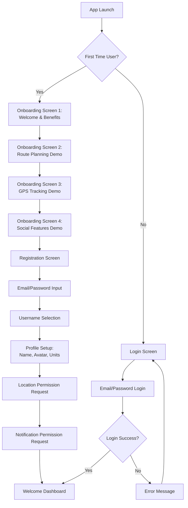
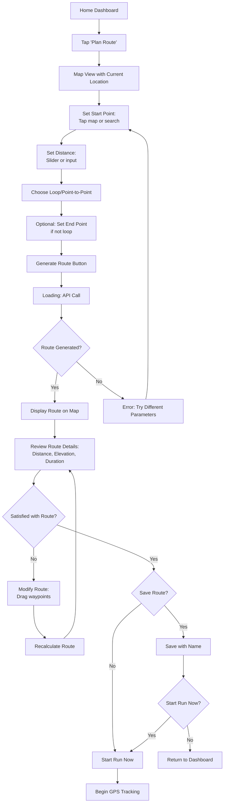
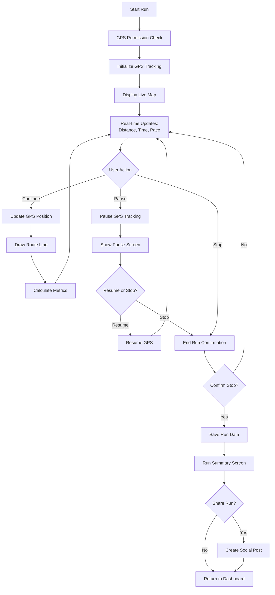
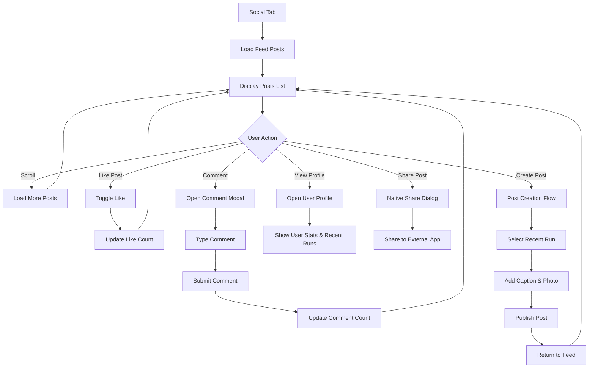
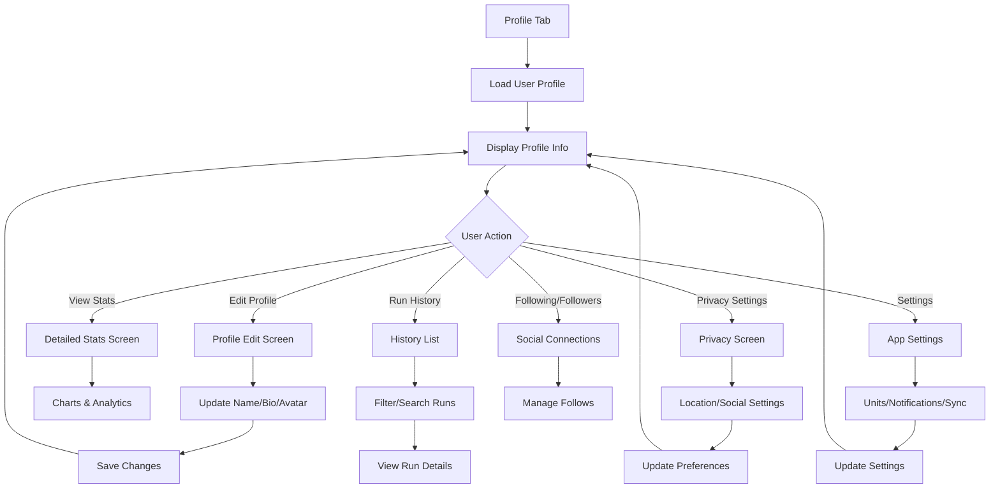

# RunRoute - User Flows & Wireframes

## 1. Overview

This document defines the complete user experience flow for RunRoute, including detailed user journeys, wireframes for key screens, and interaction patterns. The flows are designed to provide an intuitive and frictionless experience for route planning, run tracking, and social engagement.

## 2. User Journey Map

### 2.1 New User Journey
```
First Launch → Onboarding → Registration → Profile Setup → First Route → First Run → Social Discovery
     ↓              ↓           ↓            ↓             ↓           ↓             ↓
  App Store    Tutorial    Account      Preferences   Plan Route   Track GPS    Find Friends
  Download     Screens     Creation     & Location    Generation   & Complete   & Follow
```

### 2.2 Returning User Journey
```
App Launch → Home Dashboard → Choose Action → Complete Activity → Social Sharing
     ↓             ↓              ↓               ↓                  ↓
  Quick Auth   Recent Runs    Plan/Track      Save Results      Optional Post
                History        or Social       & Analytics       & Engagement
```

## 3. Core User Flows

### 3.1 User Onboarding & Registration Flow



**Wireframe: Onboarding Screens**
```
┌─────────────────────────────────────┐
│ [Skip]                    [1/4] •○○○│
│                                     │
│              🏃‍♂️                      │
│                                     │
│         Welcome to RunRoute         │
│                                     │
│    Plan custom running routes       │
│    based on your target distance    │
│                                     │
│              [Next]                 │
└─────────────────────────────────────┘

┌─────────────────────────────────────┐
│ Registration                    [×] │
│                                     │
│ Email Address                       │
│ ┌─────────────────────────────────┐ │
│ │ user@example.com                │ │
│ └─────────────────────────────────┘ │
│                                     │
│ Password                            │
│ ┌─────────────────────────────────┐ │
│ │ ••••••••••                      │ │
│ └─────────────────────────────────┘ │
│                                     │
│ Username                            │
│ ┌─────────────────────────────────┐ │
│ │ runner_joe                      │ │
│ └─────────────────────────────────┘ │
│                                     │
│         [Create Account]            │
│                                     │
│    Already have an account? Login   │
└─────────────────────────────────────┘
```

### 3.2 Route Planning Flow



**Wireframe: Route Planning Screen**
```
┌─────────────────────────────────────┐
│ ←  Plan Route              🔍 ⚙️   │
├─────────────────────────────────────┤
│                                     │
│              MAP VIEW               │
│     📍 Start Point                  │
│      ∿∿∿∿∿ Route Line              │
│           ∿∿∿∿∿                    │
│                📍 End Point         │
│                                     │
├─────────────────────────────────────┤
│ Distance: ████████░░ 5.0 km        │
│                                     │
│ ○ Loop    ○ Point-to-Point          │
│                                     │
│ 📊 Est. Time: 25 min  📈 Gain: 45m │
├─────────────────────────────────────┤
│   [Regenerate]  [Save]  [Start Run] │
└─────────────────────────────────────┘
```

### 3.3 Live Run Tracking Flow



**Wireframe: Live Run Tracking Screen**
```
┌─────────────────────────────────────┐
│ 🔴 LIVE               ⏸️  ⏹️     │
├─────────────────────────────────────┤
│                                     │
│           LIVE MAP VIEW             │
│     📍 Current Position             │
│      ~~~~ GPS Trail                 │
│                                     │
│                                     │
├─────────────────────────────────────┤
│ ⏱️  15:32        📏  2.8 km        │
│                                     │
│ 🏃 Current Pace    ⚡ Avg Pace      │
│    5:45 /km         5:32 /km       │
│                                     │
│ Target: 5.0 km     56% Complete     │
│ ████████████░░░░░░░░░░░░░░          │
├─────────────────────────────────────┤
│        [PAUSE]      [STOP]          │
└─────────────────────────────────────┘

┌─────────────────────────────────────┐
│ Run Complete! 🎉            [×]    │
├─────────────────────────────────────┤
│              MAP SUMMARY            │
│     📍────∿∿∿∿∿∿∿∿────📍          │
│                                     │
├─────────────────────────────────────┤
│ Distance: 5.2 km    Time: 26:15    │
│ Avg Pace: 5:03 /km  Calories: 312  │
│ Elevation: +47m     Max Pace: 4:21  │
│                                     │
│ Add Notes:                          │
│ ┌─────────────────────────────────┐ │
│ │ Great run! Perfect weather      │ │
│ └─────────────────────────────────┘ │
│                                     │
│   [Save Run]    [Share] [Try Again] │
└─────────────────────────────────────┘
```

### 3.4 Social Feed & Interaction Flow



**Wireframe: Social Feed Screen**
```
┌─────────────────────────────────────┐
│ Feed            🔍      👤    +    │
├─────────────────────────────────────┤
│                                     │
│ 👤 runner_joe        • 2h ago       │
│ Morning Central Park Loop 🌅        │
│                                     │
│ ┌─────────────────────────────────┐ │
│ │        ROUTE MAP PREVIEW        │ │
│ │     📍────∿∿∿∿∿∿∿∿────📍      │ │
│ └─────────────────────────────────┘ │
│                                     │
│ 5.2 km • 26:15 • 5:03 /km avg     │
│ Perfect morning for a run! 🏃‍♂️      │
│                                     │
│ ❤️ 12  💬 3  📤 Share              │
│                                     │
├─────────────────────────────────────┤
│                                     │
│ 👤 sarah_runs       • 4h ago       │
│ First 10K of the year! 🎯          │
│                                     │
│ ┌─────────────────────────────────┐ │
│ │         PHOTO + MAP             │ │
│ └─────────────────────────────────┘ │
│                                     │
│ 10.1 km • 52:30 • 5:12 /km avg    │
│ Felt amazing! Ready for marathon    │
│ training 💪                        │
│                                     │
│ ❤️ 24  💬 8  📤 Share              │
└─────────────────────────────────────┘
```

### 3.5 Profile & Settings Flow



**Wireframe: Profile Screen**
```
┌─────────────────────────────────────┐
│ Profile                        ⚙️  │
├─────────────────────────────────────┤
│                                     │
│        👤 Profile Photo             │
│                                     │
│         @runner_joe                 │
│         Joe Runner                  │
│   🏃‍♂️ Marathon runner from NYC      │
│                                     │
│ 📊 Stats Overview                   │
│ ┌─────────┬─────────┬─────────────┐ │
│ │   45    │ 450 km  │   🏃‍♂️ 162h  │ │
│ │  Runs   │Distance │    Time     │ │
│ └─────────┴─────────┴─────────────┘ │
│                                     │
│ 👥 42 Following  •  89 Followers    │
│                                     │
├─────────────────────────────────────┤
│ Recent Runs                         │
│                                     │
│ 🏃‍♂️ Morning Loop    2.5km  12min   │
│ 🏃‍♂️ Central Park    5.2km  26min   │
│ 🏃‍♂️ Brooklyn Bridge 8.1km  41min   │
│                                     │
│          [View All Runs]            │
└─────────────────────────────────────┘
```

## 4. Navigation Structure

### 4.1 App Information Architecture
```
RunRoute App
├── Bottom Tab Navigation
│   ├── Home 🏠
│   │   ├── Dashboard
│   │   ├── Quick Actions
│   │   └── Recent Activity
│   │
│   ├── Plan 📍
│   │   ├── Route Planning
│   │   ├── Saved Routes
│   │   └── Route History
│   │
│   ├── Track 🎯
│   │   ├── Live Tracking
│   │   ├── Current Session
│   │   └── Quick Start
│   │
│   ├── Feed 📱
│   │   ├── Social Feed
│   │   ├── Following Posts
│   │   └── Discover Users
│   │
│   └── Profile 👤
│       ├── User Profile
│       ├── Run History
│       ├── Statistics
│       └── Settings
│
└── Modal/Overlay Screens
    ├── Authentication
    ├── Run Details
    ├── Post Creation
    ├── Settings
    ├── Search
    └── Notifications
```

### 4.2 Screen Hierarchy & Navigation Patterns
```
Stack Navigator (Root)
├── Auth Stack (Conditional)
│   ├── Login Screen
│   ├── Register Screen
│   └── Forgot Password Screen
│
└── Main Tab Navigator
    ├── Home Stack
    │   ├── Dashboard Screen
    │   ├── Route Details Screen
    │   └── Run Details Screen
    │
    ├── Planning Stack
    │   ├── Route Planning Screen
    │   ├── Route Preview Screen
    │   ├── Saved Routes Screen
    │   └── Route Editor Screen
    │
    ├── Tracking Stack
    │   ├── Pre-Run Screen
    │   ├── Live Tracking Screen
    │   ├── Pause Screen
    │   └── Run Summary Screen
    │
    ├── Social Stack
    │   ├── Feed Screen
    │   ├── Post Details Screen
    │   ├── User Profile Screen (Other)
    │   └── Create Post Screen
    │
    └── Profile Stack
        ├── Own Profile Screen
        ├── Edit Profile Screen
        ├── Run History Screen
        ├── Statistics Screen
        └── Settings Screen
```

## 5. Interaction Patterns & UI Behaviors

### 5.1 Map Interactions
- **Single Tap**: Set start/end point or add waypoint
- **Long Press**: Open context menu or add custom waypoint
- **Drag**: Move existing waypoints to modify route
- **Pinch to Zoom**: Standard map zoom behavior
- **Pan**: Navigate around the map
- **Double Tap**: Zoom in on location

### 5.2 Route Modification
- **Drag Waypoint**: Real-time route recalculation
- **Add Waypoint**: Tap on route line to insert new point
- **Remove Waypoint**: Long press waypoint → delete option
- **Route Alternatives**: Swipe between generated options
- **Distance Adjustment**: Slider with haptic feedback

### 5.3 Live Tracking Controls
- **Pause/Resume**: Large, accessible buttons
- **Emergency Stop**: Long press stop button
- **Lock Screen**: Prevent accidental taps during run
- **Voice Updates**: Audio cues for distance/pace milestones
- **Background Mode**: Minimize battery drain

### 5.4 Social Interactions
- **Double Tap to Like**: Instagram-style heart animation
- **Swipe Actions**: Swipe left for quick like, right for share
- **Pull to Refresh**: Update feed content
- **Infinite Scroll**: Load more posts automatically
- **Haptic Feedback**: Confirm actions with subtle vibrations

## 6. Error States & Edge Cases

### 6.1 Network Connectivity Issues
```
┌─────────────────────────────────────┐
│              📡❌                    │
│                                     │
│        No Internet Connection       │
│                                     │
│   Route planning requires internet  │
│   but you can still track runs      │
│   using GPS.                        │
│                                     │
│          [Retry] [Track Offline]    │
└─────────────────────────────────────┘
```

### 6.2 GPS/Location Issues
```
┌─────────────────────────────────────┐
│              📍❌                    │
│                                     │
│        Location Services Off        │
│                                     │
│   Please enable location access     │
│   to track your runs and plan       │
│   routes.                           │
│                                     │
│         [Open Settings] [Skip]      │
└─────────────────────────────────────┘
```

### 6.3 Route Generation Failures
```
┌─────────────────────────────────────┐
│              🛣️❌                    │
│                                     │
│      Couldn't Generate Route        │
│                                     │
│   Try adjusting your distance or    │
│   choosing different start/end      │
│   points.                           │
│                                     │
│    [Try Again] [Modify Parameters]  │
└─────────────────────────────────────┘
```

## 7. Accessibility Considerations

### 7.1 Screen Reader Support
- All buttons and interactive elements have descriptive labels
- Map annotations include spoken descriptions
- Run metrics announced during live tracking
- Navigation structure clear for voice navigation

### 7.2 Visual Accessibility
- High contrast mode support
- Scalable text (supports Dynamic Type on iOS)
- Color-blind friendly color schemes
- Clear visual hierarchy and spacing

### 7.3 Motor Accessibility
- Large touch targets (minimum 44pt)
- Voice commands for run control
- Simplified gestures option
- Alternative input methods

## 8. Performance Considerations

### 8.1 Map Rendering
- Progressive loading of map tiles
- Efficient polyline rendering
- Clustering for multiple routes/runs
- Memory management for long sessions

### 8.2 Real-time Updates
- Debounced GPS updates
- Efficient WebSocket connection management
- Battery optimization during tracking
- Background task limitations handling

### 8.3 Social Feed
- Image lazy loading
- Virtual scrolling for large feeds
- Optimistic UI updates
- Intelligent caching strategies

## 9. Onboarding & Tutorial Flows

### 9.1 Progressive Disclosure
1. **Welcome Screen**: Core value proposition
2. **Route Demo**: Interactive route planning tutorial
3. **Tracking Demo**: Simulated GPS tracking experience
4. **Social Demo**: Example social feed interaction
5. **Setup**: Minimal required information

### 9.2 Feature Discovery
- **Tooltips**: First-time feature highlights
- **Empty States**: Guidance for new users
- **Progressive Hints**: Contextual tips during use
- **Help System**: In-app help and tutorials

This comprehensive user flow and wireframe specification provides a complete blueprint for developing RunRoute's user experience, ensuring intuitive navigation and engaging interactions throughout the app.